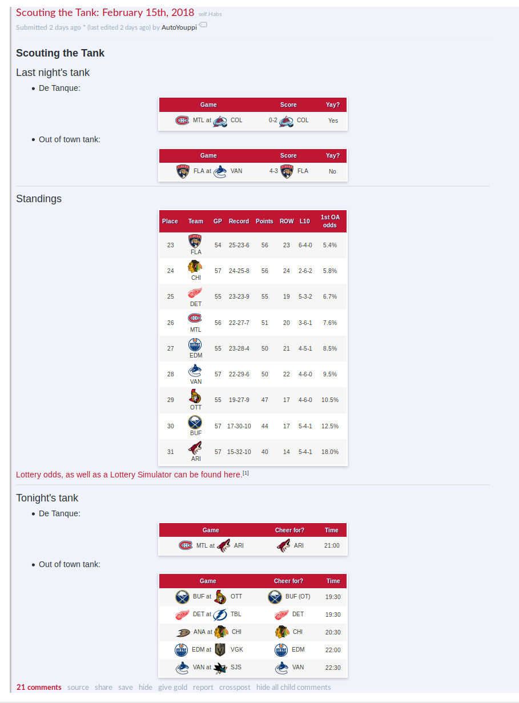

# Tankbot
Tankbot is a reddit robot that can calculate optimal tanking scenarios for NHL teams. In sports, tanking is the act
of losing on purpose to get a better position at the next entry draft. This means that you want your favorite team to
lose, and other struggling teams to win.

This robot calculates optimal tanking scenarios on a daily basis using statistics from the NHL website. It generates
three sections of information. First, there's results from last night and if the outcome was ideal for your favorite
team. Then there's the current standings as of today, only showing the teams that are within reach of your favorite
team. The last section is the schedule for tongiht. Each matchup that involves a team within reach is listed. The
"cheer for" field is the ideal outcome that could come out of the matchup. Usually the "cheer for" field will root for
the team with the lowest points in the standings to win.

This format was created by [frost_biten](https://reddit.com/u/frost_biten) on reddit. This project is an automated
version of his original idea.

# Screenshot
Here's an example of the reddit post generated for February 15th 2018, with the Montréal Canadiens set as the
favorite team:



# Configuration
A JSON file named `config.json` must exist in the working directory of the app. A systemd timer and service file are
available in the `etc/` folder, to be customized to your needs.

```js
{
    "client_id": "...", // reddit app id
    "client_secret": "...", // reddit app secret
    "username": "nhltankbot", // username of account to use
    "password": "password of account", // password of account
    "user_agent": "tankbot", // see reddit user_agent guidelines
    "my_team": "mtl", // three letter code of your team
    "subreddit": "habs", // subrreddit of your team
    "test": false // set to true to generate markdown to stdout instead of posting
}

```

# License
This project is free software licensed under the AGPLv3 license.
